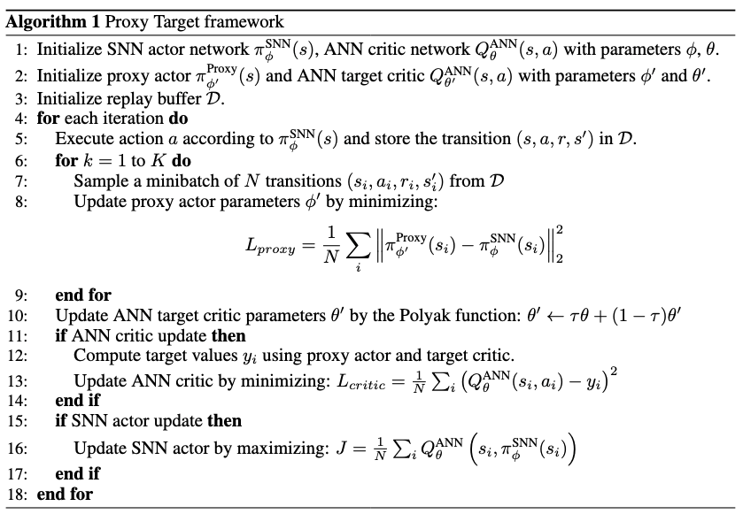

# Targeting-Spiking-Actor-Networks-in-Reinforcement-Learning
PyTorch implementation of [Proxy Target: Bridging the Gap Between Discrete Spiking Neural Networks and Continuous Control](https://arxiv.org/abs/2505.24161), accepted in NeurIPS 2025. 




## Setup
Execute the following commands to set up a conda environment to run experiments
```
conda env create -f environment.yml -n proxytarget
```


## Running Experiments
Experiments can be run by calling:
```
python main.py --env Ant-v4  --proxy Yes --spiking_neurons LIF 
```

The environment "--env" can be "Ant-v4", "HalfCheetah-v4", "Walker2d-v4", "Hopper-v4", and "InvertedDoublePendulum-v4". The spiking neurons "--spiking_neurons" can be "LIF", "CLIF", "DN", and "ANN". To test the vanilla spiking actor network without the proxy network, set "--proxy" to "No". Hyper-parameters can be modified with different arguments to main.py.

## Citing This

To cite our paper and/or this repository in publications:

```bibtex
@article{xu2025proxy,
  title={Proxy Target: Bridging the Gap Between Discrete Spiking Neural Networks and Continuous Control},
  author={Xu, Zijie and Bu, Tong and Hao, Zecheng and Ding, Jianhao and Yu, Zhaofei},
  journal={arXiv preprint arXiv:2505.24161},
  year={2025}
}
```
