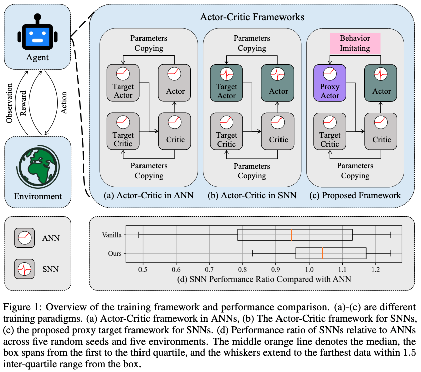

# Targeting Spiking Actor Networks in Reinforcement Learning
[[`📕 arXiv`](https://arxiv.org/abs/2505.24161)]  [[`💬 OpenReview`](https://openreview.net/forum?id=RRBve5GwjS)]

Official code release for the **NeurIPS 2025** paper 👇
### Proxy Target: Bridging the Gap Between Discrete Spiking Neural Networks and Continuous Control
Zijie Xu, Tong Bu, Zecheng Hao, Jianhao Ding, Zhaofei Yu




## Setup
Execute the following commands to set up a conda environment to run experiments
```
conda env create -f environment.yml -n proxytarget
```


## Running Experiments
Experiments can be run by calling:
```
python main.py --env Ant-v4  --proxy Yes --spiking_neurons LIF 
```

The environment "--env" can be "Ant-v4", "HalfCheetah-v4", "Walker2d-v4", "Hopper-v4", and "InvertedDoublePendulum-v4". The spiking neurons "--spiking_neurons" can be "LIF", "CLIF", "DN", and "ANN". To test the vanilla spiking actor network without the proxy network, set "--proxy" to "No". Hyper-parameters can be modified with different arguments to main.py.


## Faster Training 
To reduce the training cost associated with multiple backpropagation steps during the proxy update, we can adopt a one-step proxy update setting for the LIF neuron, with the proxy update iteration $K=1$ and proxy learning rate $lr_{proxy}=3\cdot10^{-3}$ (where the default setting is $K=3$ and $lr_{proxy}=1\cdot10^{-3}$). This lightweight configuration significantly reduces computation without major performance loss (less than 1% performance degradation).

## Citing This

To cite our paper and/or this repository in publications:

```bibtex
@inproceedings{
xu2025proxy,
title={Proxy Target: Bridging the Gap Between Discrete Spiking Neural Networks and Continuous Control},
author={Zijie Xu and Tong Bu and Zecheng Hao and Jianhao Ding and Zhaofei Yu},
booktitle={The Thirty-ninth Annual Conference on Neural Information Processing Systems},
year={2025},
url={https://openreview.net/forum?id=RRBve5GwjS}
}
```
